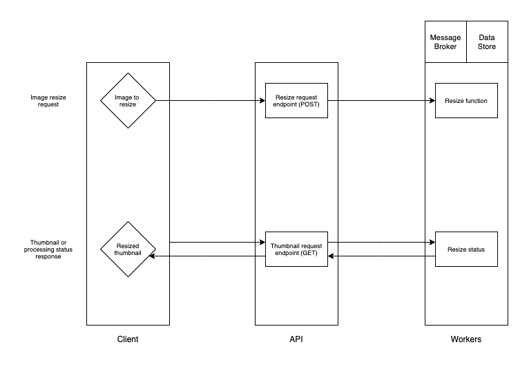
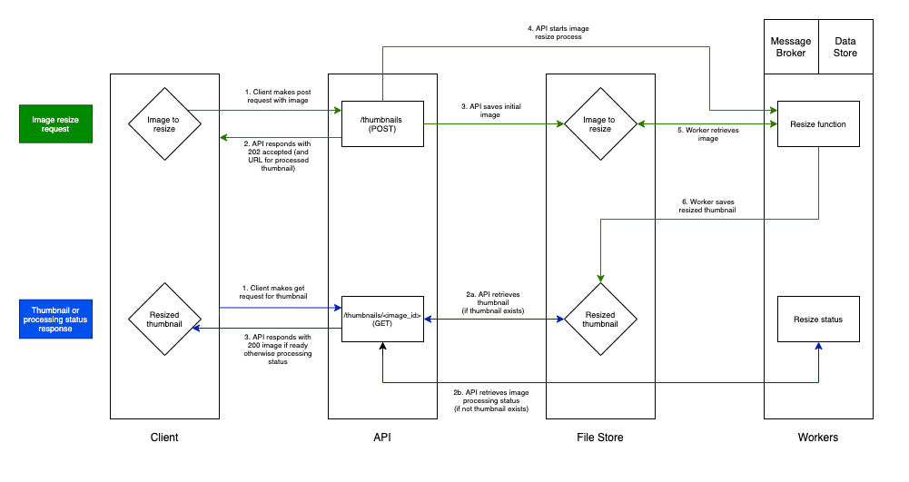

# Kayra Alat Cogent Assessment

This application is the implementation of a JSON-based REST API service which resizes images into 100x100px thumbnails.

## Installation and User Guide

System requirements:

* [Docker 20.10.5](https://docs.docker.com/get-started/)
* [Docker compose 1.28.5](https://docs.docker.com/compose/install/)
* [Curl 7.64.1](https://curl.se)

**A [Makefile](Makefile) has been included for your convenience, please be sure to refer to it if you wish to customise the commands.** Simply omit the '@' symbol at the start of the command and copy and paste it into bash for the same outcome.

Build and start server:

```
make start
```

Once the server has been started, it will be accessible at [http://127.0.0.1:8000/](http://127.0.0.1:8000/). **Please ensure this host and port are not being used before starting the application.** Additionally, the OpenAPI documentation can be accessed at http://127.0.0.1:8000/docs.

Send an [image](example_image.jpg) **(while the server is running)**:

```
make send-image
```

To retrieve the resized thumbnail, visit the URL provided in the successful response of the `make send-image` request to the API. Alternatively, send the following curl request using the image filename provided in the API response **(while the server is running)**:

```bash
curl -O --request GET \
  --url http://127.0.0.1:8000/thumbnail/<image_filename>
```

Run unit tests **(while the server is running)**:

```bash
make unit-tests
```

Run the integration tests **(while the server is running)**:

```bash
make integration-tests
```

## System Design

### High Level Architecture

The system comprises of an **API** (Fastapi) and a **Worker** service (Celery, Redis, RabbitMQ). The **API** has been built using a polling architecture, and exposes two endpoints:

* `/thumbnails` - Allows the **Client** to POST an image to be resized, and interacts with the Celery **Worker** to start the resizing task. This endpoint will return the URL that the client can poll for the resized thumbnail.
* `/thumbnails/<image_name>` - Allows the **Client** to GET the resized thumbnail. The **API** will check to see if the thumbnail exists:
  *  If the thumbnail exists, the **API** will return the thumbnail image file to the **Client**.
  * If the thumbnail does not exist, the **API** will communicate with the worker to identify the current status of the resizing process and return the status to the **Client**.



### Data Flow

The flow of data has been described with the processes being started by the **Client**, and details the events that occur through each process and the possible conditional processes. 

Though data validation has been implemented, for simplicity the described data flow assumes valid requests are being made at every step.



#### Image Resize Request

1. The **Client** makes a POST request to the `/thumbnails` endpoint of the **API** with an image as a `multipart/form-data`.
2. The **API** responds to the **Client** with a 202 Accepted and a URL to the thumbnail resource for the **Client** to poll. The **API** also asynchronously starts tasks described in steps 3 and 4. (Note: The trade-off for keeping this endpoint non-blocking is described in the Design Choices).
3. The **API** saves the image to the **File Store**.
4. The **API** tells the **Worker** to start the image resize task and passes it the location of the saved image to be resized.
5. The **Worker** task retrieves the image to be resized from the **File Store** and resizes it. (Note: The **Worker** will retry starting the process until the image has been fully downloaded).
6. The **Worker** task saves the processed thumbnail to the **File Store**.

#### Thumbnail or Processing Status Response

1. The **Client** makes a POST request to the `/thumbnails/<image_name>` endpoint of the **API**.

2. The **API** checks if the thumbnail exists in the **File Store**:

   a. If the thumbnail exists: The **API** retrieves the thumbnail from the **File Store**.

   b. If the thumbnail doesn't exist: The **API** retrieves the status of the resizing process from the **Worker** task.

3. The **API** responds to the **Client** with the thumbnail image if it exists, or status JSON if it does not exist.

### Implemented Technologies

The **API** and **Worker** services are built using [Python 3.8](https://www.python.org/downloads/release/python-380/). 

The [Fastapi](https://fastapi.tiangolo.com) framework was chosen for the **API** service for its asynchronous properties and high performance, lack of boilerplate, and relevant features (REST helpers and auto generated documentation).

[Celery](https://docs.celeryproject.org/en/stable/) was chosen as the task queue for the **Worker** for its ease of use, high level of support, and relevant features (retry support and task state monitoring). Celery relies on [RabbitMQ](https://www.rabbitmq.com) for its message broker and [Redis](https://redis.io) for its data store.

[Pytest](https://docs.pytest.org/en/stable/) was used as the testing framework for its ease of use and relevant features (fixtures), and the [Requests](https://docs.python-requests.org/en/master/) library was used to simplify the integration testing of the API endpoints.

[Docker](https://www.docker.com) and [Docker Compose](https://docs.docker.com/compose/) were used to manage the building and running of the application.

## Design Choices

#### Polling vs [Background Tasks](https://fastapi.tiangolo.com/tutorial/background-tasks/)

It is possible to implement a similar thumbnail polling solution using Fastapi's asynchronous Background Tasks instead of a **Worker** service (Celery, RabbitMQ, Redis), making the system much simpler, speeding up development time, and requiring less maintenance.

However, in context of being assessed on the skills required to implement more technical and realistic polling solutions, Background Tasks would have not adequately demonstrated my decision making process and technical ability. 

Additionally, Background Tasks lack common features required by industry standard polling solutions, such as retry policies and task state monitoring.

#### Polling vs Web Hooks

A Web Hook solution would have been more efficient and performant as the inherent nature of polling often requires the **Client** to make multiple **API** requests to check the status of the process until it is complete. Web Hooks reduce the amount of requests required in the entire process, which can have a big impact at scale, and would be likely to make a significant reduction in server costs when compared to polling.

However, the implementation of a Web Hook solution typically requires knowledge of the **Client** in the system to be able to notify the **Client** of the task being completed, allowing the **Client** to continue the process. This was not provided in the specification, and its assumption would have complicated the process of testing the application for Cogent engineers and assessors. 

Under the correct conditions, a Web Hook solution would often be my personal preference for a long running process architecture similar to the one described in the specification.

#### Polling vs Web Sockets

A Web Socket solution would have required keeping a connection open between the **Client** and **API** for a considerable amount of time, in exchange for a real time dynamic information exchange.

Because the  did not define any requirement for dynamic progress updates, or a need for the Client to be made aware as soon as the process was complete, a Web Socket solution would have consumed more server resource than necessary for little benefit.

#### Non-blocking `/thumbnails` POST endpoint

The `/thumbnails` **API** endpoint returns a 202 Accepted response to the **Client** before the image has been saved, and before the resize task has been started. Because of this, the response may not be accurate as it would not reflect either of these processes failing if they did.

Validation on the image has been implemented to mitigate this.

However, this implementation is still a trade off and would require more real world information about the needs of the **Client** to achieve the correct decision. The current implementation favours the performance of the **API** in exchange for the accuracy/usefulness of the response. This has been done with the belief that the **API**'s responsibility is to facilitate communication, and should not be blocked. The resizing status can be discerned from the from the status (or image) returned by the `/thumbnails/<image_name>` endpoint, and the **Client** can resend the initial POST request based on that status if required.

If in the real world the **Client** valued the accuracy/usefulness of the response over the response time of the **API**, this endpoint would be implemented to block the connection until the verification of a successful image upload and task  could be completed.

## Preparation for Production

### Application Considerations

##### Integration

It is likely that this application would work alongside others in a production environment. If this service were to be integrated into an existing microservice architecture, it is likely that a larger API would exist to tie multiple services together, acting as an orchestration service. 

While it would be tempting to merge the API of this service with the orchestration API, keeping them separate would allow the service to be scaled independently, and could be scaled based on the needs of the Worker (Celery) dynamically, rather than scaling the entire orchestration service just to process more images. It is unlikely that the API of the thumbnail service would be a bottleneck due to the non-blocking nature of its architecture (part of the reasoning behind my decision to do so).

Additionally, the API can be changed from REST to a messaging platform like Kafka relatively easily if required for integration with a larger system.

##### Cloud Platform Configuration

The application would need to be more specifically configured to suit the platform it was being deployed on. This would likely mean setting the application up based on variables set by a provisioning service exposed in the environment that are then accessed via Python's `os.getenv`.

##### Rate Limiting

If made publicly accessible, it would also be wise to implement rate limiting to prevent high server costs due to misuse or malicious activity such as a denial of service attack.

### Security Concerns

Image retention time would need to be established, potentially with the third party/parties using the application, to ensure data protection laws and agreements were being fulfilled. While this could impact the effectiveness caching, it would also result in reduced server costs at scale.

Additionally the service would need to communicate via HTTPS, and it is likely a robust authentication system would need to be implemented for any feature requiring authorisation (see Additional Feature Development Ideas).

#### Testing

While unit tests and integration tests are currently in place, it would be possible to increase the number of tests to more exhaustively capture potential use cases and errors. Doing so would make the system less flexible to change and potentially slow down future development, and would need to be implemented with a clear vision for the future of the application.

It would be essential to create end-to-end tests if this application were to be integrated into a larger system. In its current form, the integration tests can also be considered end-to-end tests.

The current [integration tests](server/app/tests/integration_tests/test_thumbnail_views.py) may need to be modified based on the preferences of the team with regard to the CI/CD tooling:

* `test_request_pending_image` tests that a pending status is returned while the image resize process is still being completed. Currently this is achieved by generating a large image to process, and can be changed depending on the requirements of the circumstances:
  * If the tests need to pass more often, the size of the generated image could be increased further at the cost of the test run time.
  * If the tests need to pass more quickly, the size of the generated image could be reduced, at the cost of the tests sometimes failing if the server processes the image before the status request can be made.
* `test_request_valid_image` tests that an image submitted to the application is appropriately resized to 100x100px. As part of this test, the `/thumbnails/<image_name>` is polled with a delay of 1 second between each request, this can changed depending on the requirements of the circumstances:
  * If the tests need to pass more often, the delay can be increased so the development server is not overwhelmed at the cost of the test run time.
  * If the tests need to pass more quickly, the delay can be reduced, at the cost of the tests sometimes failing if the server is overwhelmed.

### Additional Tooling

* CI/CD ([Github Actions](https://github.com/features/actions))
* Caching ([Fastapi caching](https://pypi.org/project/fastapi-caching/))
* Logging and Monitoring ([Sentry](https://sentry.io), [Flower task monitoring for Celery](https://flower.readthedocs.io/en/latest/))
* Static File Serving ([AWS S3](https://aws.amazon.com/s3/))
* Load Balancing ([AWS ELB](https://aws.amazon.com/elasticloadbalancing/?elb-whats-new.sort-by=item.additionalFields.postDateTime&elb-whats-new.sort-order=desc))

## Additional Feature Development Ideas

* Image resizer could maintain the aspect ratio by using cropping in the process of creating the thumbnail.
* Ability for the client to determine the size of the thumbnail via the API.
* Ability for the client to cancel the resize request mid process via the API.
* Multi-file upload endpoint exposed by the API.
* Dynamic Web Hook implementation to allow the Client to define their own endpoint to be used to notifiy when the resize task is complete.
* Web Socket notification service:
  * Provide the client with real time updates when resource is ready and the link to the resource when it is ready.
  * This could also prompt the client for mid process decisions for more complex workflows.
* Authentication for both making the request and downloading the image:
  * User client authentication via account persistence, sign in and JWT for access.
  * Key authentication for system clients.
  